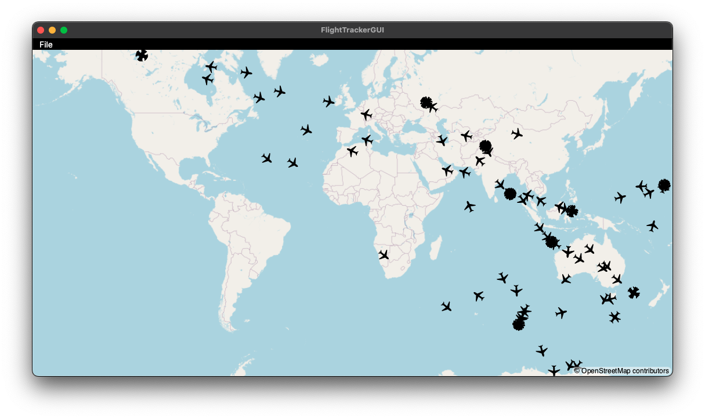
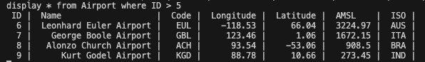

# Flight Tracker Project

## Overview
The **Flight Tracker** project demonstrates the application of various design patterns, focusing on clean, scalable code architecture. The goal of this project was to showcase my knowledge and understanding of different design patterns while building a functional and interactive flight tracking system.

This project includes a variety of features, from reading data from files to simulating and displaying planes on a map in a GUI. Several key design patterns were used to solve common problems, including the **Factory**, **Builder**, **Publisher**, **Visitor**, **Iterator**, and **Logger** patterns. Below is a detailed explanation of the functionality and design patterns implemented in the project.

---

## Screenshots

### 1. **GUI Display**


### 2. **SQL-like Command Handling**


---

## Features

### 1. **Object Creation & Serialization**
   - **Factory Pattern**: Used to create objects when reading from a `.ftr` file. This includes creating instances of various flight-related objects (e.g., `Airport`, `Flight`, `Passenger`, `Crew`, etc.).
   - The data is stored in memory and serialized into a `FlightObjects.json` file for persistence.

### 2. **GUI & Flight Movement Simulation**
   - A **GUI** displays planes moving across a map. The planes are initially loaded from the `.ftr` file and then their positions are handled by the `FlightUpdate` class.
   - The **FlightUpdate Class**:
     - Adjusts plane positions based on the current time.
     - Calculates speed, rotation, and interpolates values to update the planes every second.
     - Planes stop once they reach their destination.
   - **Adapter Pattern**: Used to adapt the plane objects to the specific needs of the GUI for display.
   - **Publisher Pattern**: Used to handle events and updates from the network source simulator, causing planes to jump on the map based on updated positions.
   - Planes' movement depends on their flight duration, with stationary planes waiting for their takeoff time.

### 3. **Command Pattern Implementation**
   - Several commands demonstrate the use of design patterns:
     - ```print```: Serializes the current state to a JSON file.
     - ```report```: Generates a news-like report from various sources (newspaper, radio, television) using the **Visitor** pattern. The report uses the **Iterator** pattern to iterate over all objects and produce a structured output.
     - ```exit```: Stops all processes but does not close the GUI window.

### 4. **SQL-like Command Handling**
   The project includes several **SQL-like commands** that allow users to interact with the flight data:
   - **Display Command**: Displays specific fields from different object classes (`Airport`, `Flight`, `Crew`, `Cargo`, etc.) with conditions and logical operators.
   - **Delete Command**: Deletes specific records based on conditions.
   - **Update Command**: Updates specific fields in the object classes based on conditions.
   - **Add Command**: Adds new objects to the system based on input data.

   Examples of usage:
   - `display * from Airport`
   - `delete Airport where ID <= 6 and AMSL >= 1000.00`
   - `delete Airport `
   - `update Airport set (ISO=NaN, Code=NaN) where Longitude > 100`
   - `add Airport new (ID=99, Name=Test Airport, Code=ABC)`

---

## Design Patterns Used

### 1. **Factory Pattern**
   - Used to create flight-related objects when reading from the `.ftr` file and for creating field wrappers needed for the update queries.

### 2. **Builder Pattern**
   - Used to construct new objects, especially when processing the `add` query to create new records.

### 3. **Publisher-Subscriber Pattern**
   - Used to handle change events from the network source simulator, updating the appropriate managers and triggering updates across the system.

### 4. **Iterator Pattern**
   - Applied to iterate through each object in the news generation process and report the gathered information across various news providers.

### 5. **Visitor Pattern**
   - Utilized for generating dynamic news reports from various data sources (newspaper, radio, television), each with their own reporting style.

### 6. **Logger Pattern**
   - Used for logging changes and actions in the system, providing a traceable history of events.

### 7. **Wrapper Pattern**
   - Applied to wrap fields or objects for easier condition application in SQL-like commands (e.g., `where` conditions).

---

## Installation & Running the Project

### Prerequisites
Ensure you have **.NET SDK** installed on your system.

### Build and Run

```bash
dotnet build
dotnet run
```

---

## Known Issues

### GUI Bug
The GUI and the network source simulator were not developed by me. I encountered a bug preventing planes from being deleted from the map once they have been shown. Consequently, when planes reach their destination, they remain stationary on the map instead of being removed. I plan to fix this bug in the future once the necessary changes can be made to the GUI code.

---
## Disclaimer
The GUI and network source simulator were not authored by me. All other code, including core logic and design, is my work.

---
## Conclusion
This project demonstrates my proficiency in using various design patterns and my ability to write modular, scalable, and maintainable code. It effectively showcases my problem-solving and software design capabilities in a complex, real-world application scenario.

